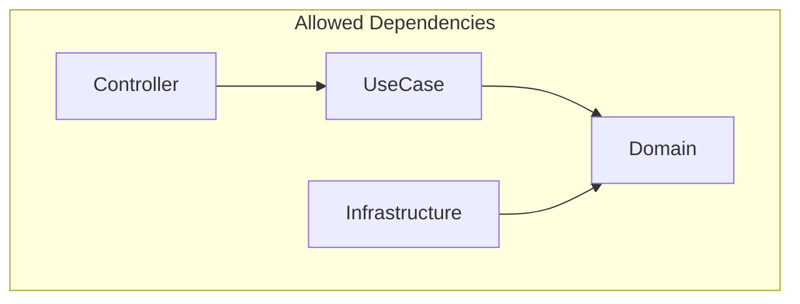
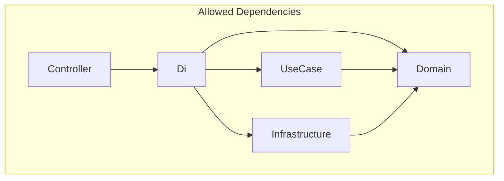

# 依存関係の向き
## 概略

```mermaid
graph LR
    subgraph Allowed Dependencies
        direction LR
        API2["Controller"] --> UC2["UseCase"]
        UC2 --> DOMAIN2["Domain"]
        INFRA2["Infrastructure"] --> DOMAIN2
    end
```

## 詳細
以下のような各レイヤの依存関係をDi層を経由して解決
- UseCaseとRepositoryの紐付け
- RepositoryとDBコネクションの紐付け

Di層が依存関係の汚れ役を引き受けることで、その他レイヤの依存関係が簡潔に保たれる

```mermaid
graph LR
    subgraph Allowed Dependencies
        direction LR
        API2["Controller"] --> DI2["Di"]
        DI2 --> UC2["UseCase"]
        DI2 --> INFRA2["Infrastructure"]
        DI2 --> DOMAIN2["Domain"]
        UC2 --> DOMAIN2["Domain"]
        INFRA2 --> DOMAIN2
    end
```

# 依存関係設計ポリシー
<!-- TODO -->
