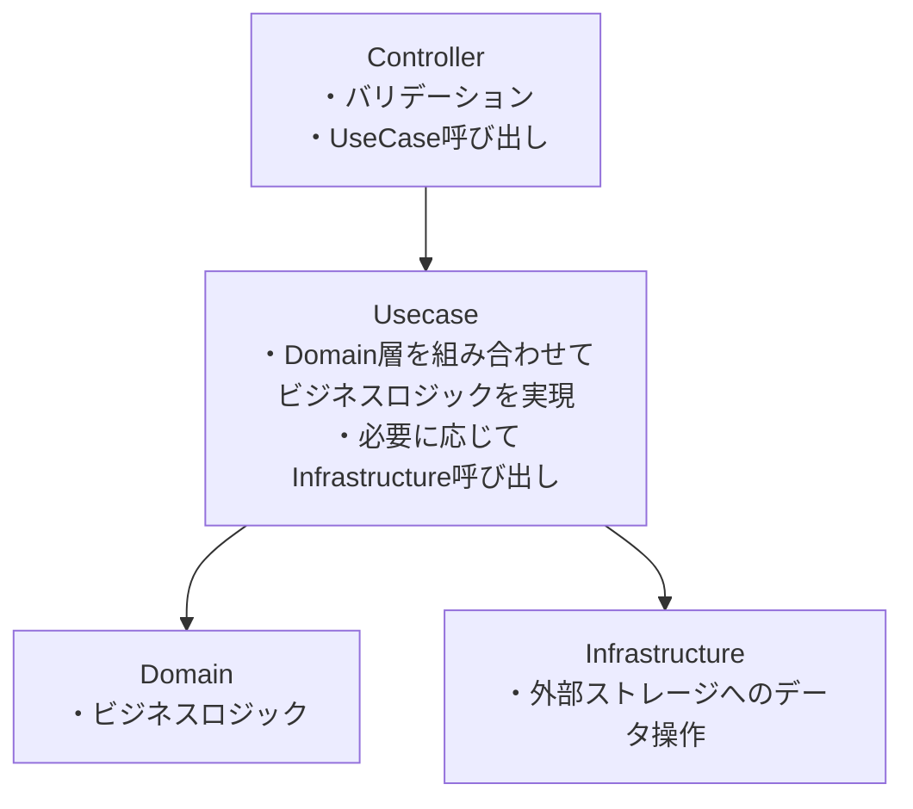
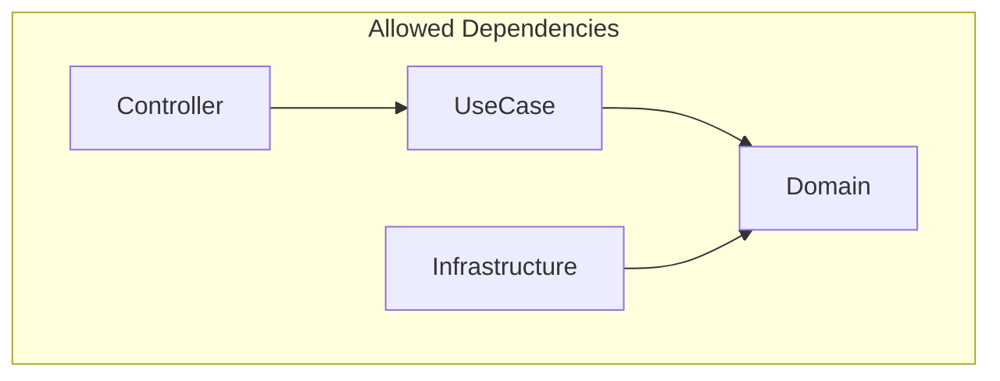

# データの流れ及び各レイヤの概要

# 依存関係の向き

# Domain VS Domain Service
1. エンティティ単体で完結 > エンティティ。 不変条件や状態遷移ロジックは極力エンティティ内で閉じる。
1. 複数エンティティ／リポジトリが絡む > ドメインサービス。 永続化や他アグリゲートへの問い合わせが前提のルールはサービスで吸収。
1. サービスは“調停役”と捉える。 エンティティ同士・リポジトリとの協調が必要になった瞬間がドメインサービスの出番。

# 例外設計ポリシー
FastAPI のグローバル例外ハンドラ（`app/core/middleware/exception_handlers.py`）は `BaseCustomException` を継承したユーザ定義例外を前提にログ・レスポンスを制御している。新しいドメイン/アプリケーションコードでは、基本的に次の2系統の例外を使い分ける。

- ビジネス系例外（`app/domain/exceptions/business.py`）
  - `BusinessRuleException` 派生クラスを利用する。
  - ユーザ入力の誤りやドメイン制約違反など、利用者が対処可能な事象を表す。
  - ログレベルは WARNING、HTTP レスポンスは 4xx 系を返す。
  - `user_message` プロパティで利用者向けメッセージを明示し、内部情報は出さない。
- システム系例外（`app/domain/exceptions/system.py`）
  - `SystemException` 派生クラスを利用する。
  - 永続化層の障害や外部サービス連携の失敗など、利用者側で対処できない事象を表す。
  - ログレベルは ERROR（クリティカル系は `include_exc_info=True` でスタックトレースを出力）、HTTP レスポンスは 5xx 系を返す。
  - `DataOperationException` のように `operation_context` を渡すと、ハンドラでログに操作名が出力されトラブルシュートしやすくなる。

いずれの系統でも、設計方針は「例外クラス側でログレベル・レスポンス情報を決める」「ハンドラは `BaseCustomException` を受け取って一貫した処理を行う」というもの。ドメインコードで標準例外のみを送出するとグローバルハンドラの `Exception` キャッチに流れ、HTTP 500 として返却されるため、意図的なビジネス判定には必ずユーザ定義例外を使う。

新しい例外を追加する際は、上記どちらの系統かを判断し、`log_level` / `user_message` / `http_status_code` プロパティを適切に実装する。また、例外の `details` には復旧に役立つ情報（フィールド名・制約名など）だけを含め、機密情報やスタックトレースは入れない。

# バリデーション設計ポリシー
FastAPI エンドポイントからドメインまでの層構造（API → DTO → ユースケース → ドメインモデル → リポジトリ）に沿って、各層ごとに守るべき責務を明確に分担する。重複を恐れず二重化することで、別経路からの呼び出しや将来の拡張にも耐えられる。

## Controller
- リクエスト構造・型・必須項目など「入力の形」をここで保証する。`field_validator` などを利用し、422 を返せる形で早期に弾く。
- 単純なフォーマットやトリミング、Null 可否、桁数チェックは DTO 側で処理し、ユースケースへ渡るデータの素性を揃える。
- DTO で `ValidationException` を送出する場合は、API レスポンス仕様（422 か 400 か）との整合を確認する。

## Usecase
- ビジネスフローや他コンポーネント連携に依存する検証を行う。例：同一ユーザの Todo タイトル重複判定、参照リソースの存在確認。
- 例外はドメインのカスタム例外へ握り替え、HTTP ステータスが意図通りになるよう制御する。

## Domain
- エンティティが常に満たすべき不変条件（タイトル必須、期限の整合性など）を実装し、どの経路から生成・更新されても破れないようにする。
- モデル生成時や状態遷移時にバリデーションを実行し、失敗時はビジネス系例外を投げる。

## Infrastructure
- データベース制約（NOT NULL、UNIQUE など）で最終防衛線を敷き、DTO やドメインで取り逃した異常を捕捉する。
- DB 例外は `DataOperationException` などに変換し、システム系エラーとして扱う。ログには操作名を含める。

この分担により、「入り口で防げるものは DTO」「ビジネス文脈はユースケース」「絶対に破らせたくない不変条件はドメインモデル」「最終砦は DB 制約」となる。層を跨ぐ仕様変更が入った場合でも、責務の境界を明確に保ちやすい。

# 依存関係設計ポリシー
<!-- TODO -->

# Usecase
## 役割
- Domain Entityを組み立てて、**ビジネスロジック**を実現する
- 必要に応じてInfrastructure呼び出し

## ファイル作成単位
1 usecaseファイルに対して1ファイル

## ファイル名
`{ユースケース名}_usecase.py`とする

## ユースケースの単位の考え方
- その名の通り、APIの利用者視点でのユースケース単位とする
  - 例）ユーザ情報の更新→update_user_info_usecase

## メソッド名
`execute`とする

# Repository

## 例外処理
- Infrastructureのリポジトリは SQLAlchemy を介してデータベースにアクセスする。ドメイン層へドライバ依存の例外を漏らさないため、SQLAlchemy が投げる `SQLAlchemyError`（接続エラー、制約違反、トランザクション失敗など）をキャッチし、`DataOperationException` などのシステム系カスタム例外に置き換える。
- 例外へは `operation_context` を必ず渡し、どの操作（例: `todo_repository.create`）で失敗したのかを記録する。グローバル例外ハンドラがこの情報をログに出力し、トラブルシュートしやすくなる。
- `SQLAlchemyError` で拾えない問題（プロセス外のネットワーク断など）は上位へ到達するが、上記方針により DB レイヤ由来の一般的な障害は一貫してシステム例外として扱える。

