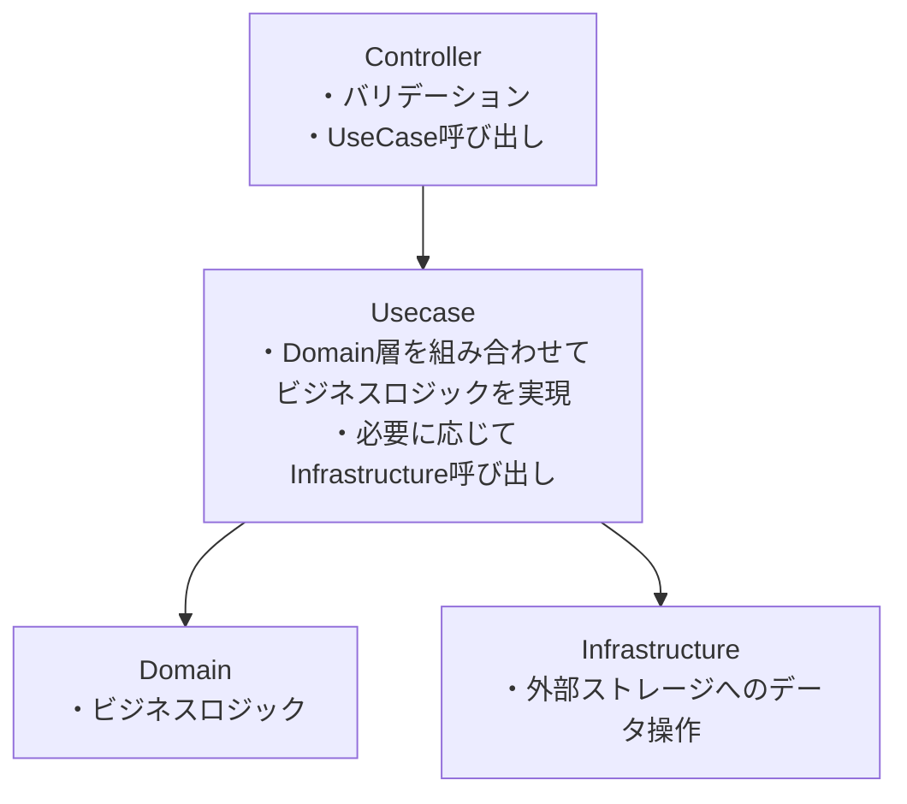

# データの流れ及び各レイヤの概要

# 設計ポリシー
- [依存関係設計ポリシー](./coding/dependency_policy.md)
- [例外設計ポリシー](./coding/exception_policy.md)

# バリデーション設計ポリシー
各レイヤのバリデーション責務については、それぞれのレイヤ別ガイドを参照してください。

# レイヤ別ガイド
- [Controller](./coding/controller.md)
- [Usecase](./coding/usecase.md)
- [Domain](./coding/domain.md)
- [Repository](./coding/repository.md)